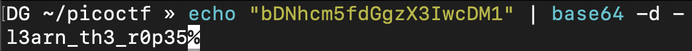
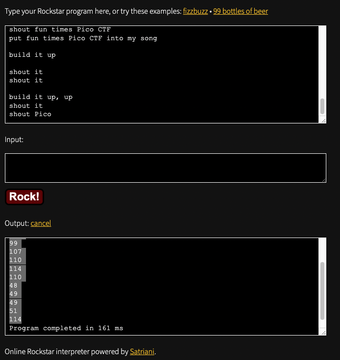

# Reverse engineering

## vault-door-training

Your mission is to enter Dr. Evil's laboratory and retrieve the blueprints for his Doomsday Project. The laboratory is protected by a series of locked vault doors. Each door is controlled by a computer and requires a password to open. Unfortunately, our undercover agents have not been able to obtain the secret passwords for the vault doors, but one of our junior agents obtained the source code for each vault's computer! You will need to read the source code for each level to figure out what the password is for that vault door. As a warmup, we have created a replica vault in our training facility. The source code for the training vault is here: VaultDoorTraining.java

LOL flag dans le code source


flag: `picoCTF{w4rm1ng_Up_w1tH_jAv4_3b500738c12}`

## vault-door-1

This vault uses some complicated arrays! I hope you can make sense of it, special agent. The source code for this vault is here: VaultDoor1.java


Il faut juste mettre les charactères dans l'ordres pour obtenir le flag.

flag: `picoCTF{d35cr4mbl3_tH3_cH4r4cT3r5_03f841}`

## vault-door-3

This vault uses for-loops and byte arrays. The source code for this vault is here: VaultDoor3.java

Simplement reverse la fonction check password pour
obtenir le mdp.


flag: `picoCTF{jU5t_a_s1mpl3_an4gr4m_4_u_7f35db}`

## vault-door-4

This vault uses ASCII encoding for the password. The source code for this vault is here: VaultDoor4.java

Le plus facile après vault-door-1


## vault-door-5

In the last challenge, you mastered octal (base 8), decimal (base 10), and hexadecimal (base 16) numbers, but this vault door uses a different change of base as well as URL encoding! The source code for this vault is here: VaultDoor5.java

Très simple, suffis de décoder URI a partir de base64


## vault-door-6

This vault uses an XOR encryption scheme. The source code for this vault is here: VaultDoor6.java

bytes pris directement du fichier vaultdoor 6.
ajouter tous les charactère en effectuant un XOR


ajouter les caractères en effectuant un XOR sur l'offset 0x55
qui est dans le fichier.


## vault-door-7

This vault uses bit shifts to convert a password string into an array of integers. Hurry, agent, we are running out of time to stop Dr. Evil's nefarious plans! The source code for this vault is here: VaultDoor7.java

Je trouve ma solution très elegante. j'ai documenter toute
ma solution


## vault-door-8

Apparently Dr. Evil's minions knew that our agency was making copies of their source code, because they intentionally sabotaged this source code in order to make it harder for our agents to analyze and crack into! The result is a quite mess, but I trust that my best special agent will find a way to solve it. The source code for this vault is here: VaultDoor8.java

Juste pris les méthode déjà dans le fichier pour créer une solution
qui est adaptée.


flag: `picoCTF{s0m3_m0r3_b1t_sh1fTiNg_0c59dbf4d}`

# Cryptography

Pour la crypotgraphie, une ressource importante est:

[CyberChief](https://gchq.github.io/CyberChef/)

## Tapping


flag: `PICOCTF{m0rs3c0d31sfun1818224575}`

# General

## Lets warm up (50 points)

If I told you a word started with 0x70 in hexadecimal, what would it start with in ASCII?

```
$ python3 -q
>>> chr(0x70)
'p'
```


flag: `picoCTF{p}`

## 2Warm(50 points)

Can you convert the number 42 (base 10) to binary (base 2)?

```
$ python3 -q
>>> bin(42)[2:]
'101010'
```


flag: `picoCTF{101010}`

## Warmed Up (50 points)

What is 0x3D (base 16) in decimal (base 10).

```
$ python3 -q
>>> 0x3D
61
```


flag: `picoCTF{61}`

## Bases (100 points)

What does this `bDNhcm5fdGgzX3IwcDM1` mean? I think it has something to do with bases.

```
$ echo "bDNhcm5fdGgzX3IwcDM1" | base64 -d -
l3arn_th3_r0p35
```



flag: `picoCTF{l3arn_th3_r0p35}`

## First Grep (100 points)

Can you find the flag in file? This would be really tedious to look through manually, something tells me there is a better way. You can also find the file in /problems/first-grep_5_452e1c1630eb14b6753e9a155c3ae588 on the shell server.


flag: `picoCTF{grep_is_good_to_find_things_887251c6}`

## Resources (100 points)

We put together a bunch of resources to help you out on our website! If you go over there, you might even find a flag! [link](https://picoctf.com/resources)

Trouvé avec time machine pour avoir le flag de la compétition 2019.


flag: `picoCTF{r3source_pag3_f1ag}`

## Strings it

Can you find the flag in file without running it? You can also find the file in /problems/strings-it_4_e276260a1b64a734b4178a280d25b754 on the shell server.


flag: `picoCTF{5tRIng5_1T_c611cac7`

## what's a net cat? (100 points)

Using netcat (nc) is going to be pretty important. Can you connect to 2019shell1.picoctf.com at port 12265 to get the flag?


flag: `picoCTF{nEtCat_Mast3ry_74df27a3}`

## based (200 points)

To get truly 1337, you must understand different data encodings, such as hexadecimal or binary. Can you get the flag from this program to prove you are on the way to becoming 1337? Connect with nc 2019shell1.picoctf.com 20836.

Premier binaire à ASCII, deuxième octal à ASCII et le troisième
est hex à ASCII.
[binaire ASCII](https://www.rapidtables.com/convert/number/binary-to-ascii.html)
[octal ASCII](http://www.unit-conversion.info/texttools/octal/)
[hex ASCII](https://www.rapidtables.com/convert/number/hex-to-ascii.html)


flag: `picoCTF{learning_about_converting_values_6cdcad0d}`

## plumbing (200 pts)


Sometimes you need to handle process data outside of a file. Can you find a way to keep the output from this program and search for the flag? Connect to 2019shell1.picoctf.com 13203.

flag: `picoCTF{digital_plumb3r_995d3c81}`

## mus1c

I wrote you a song. Put it in the picoCTF{} flag format




flag: `picoCTF{rrrocknrn0113r}`

## 1_wanna_b3_a_r0ck5tar

I wrote you another song. Put the flag in the picoCTF{} flag format


flag: `picoCTF{BONJOVI}`

## flag shop (300 points)

There's a flag shop selling stuff, can you buy a flag? Source. Connect with nc 2019shell1.picoctf.com 20836.

integer overflow


flag: `picoCTF{m0n3y_bag5_34c9a5f7}`